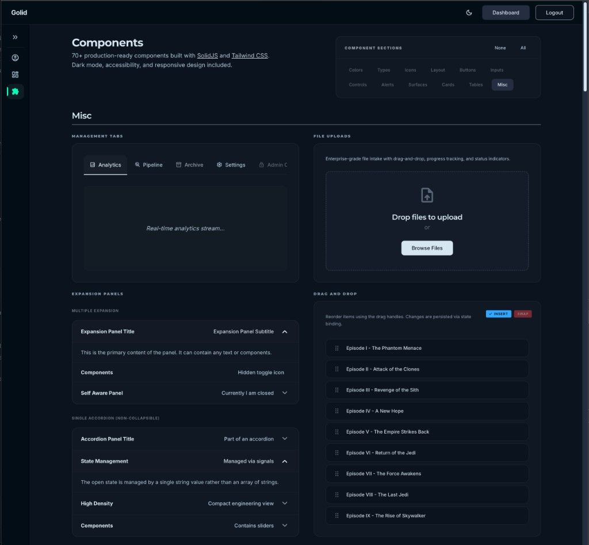

<p align="center">
  
</p>

<h1 align="center">Golid</h1>

<p align="center">
  <a href="https://github.com/golid-ai/golid/actions/workflows/ci.yml"></a>
  <a href="https://codecov.io/gh/golid-ai/golid"></a>
  
  
  
  
  
  
</p>

A production-ready **Go + SolidJS** framework. Auth, 70+ UI components, SSR, real-time events, and one-command deployment — skip the boilerplate week and start building.

<p align="center"><strong><a href="https://golid.ai">golid.ai</a></strong> — Live demo featuring the full component library</p>

<p align="center">
  
  
</p>

## Why Golid?

Most starter templates give you a folder structure and leave you to wire everything yourself. Golid gives you a working production app on day one.

- **Zero to deployed in minutes** — `docker compose up` starts everything. `./scripts/deploy.sh` provisions Cloud Run, Cloud SQL, and secrets in a single command. No 200-step setup guide.
- **Go + SolidJS > Node + React** — Go compiles to a single binary, starts in <100ms, handles 10x the concurrent connections of Node.js. SolidJS benchmarks faster than React in every metric. No vendor lock-in to Vercel.
- **Opt-in complexity** — Email, job queues, tracing, and metrics are off by default. Set one env var to enable each. `docker compose up` works with zero configuration.
- **AI-native development** — 23 Cursor AI rules auto-activate based on which file you're editing. AI assistants generate code that follows established codebase patterns on the first try.
- **740+ tests across three layers** — Go unit + integration (real PostgreSQL), SolidJS component tests, and 22 Playwright E2E tests. 82%+ Codecov coverage. Not a scaffold — a framework that proves itself.
- **No vendor lock-in** — Runs on Cloud Run, Fly.io, Railway, Render, or bare metal. PostgreSQL everywhere. No proprietary abstractions.

| | Golid | Next.js + API | Go-only starters | Rails / Laravel |
|---|---|---|---|---|
| Full-stack type safety | Go + TypeScript ([OpenAPI spec](backend/openapi.yaml) with type generation pipeline) | TypeScript (tRPC/Zod) | Go only | Ruby/PHP |
| Production UI library | 70+ components | BYO | None | Blade/Livewire |
| SSR + real-time | SSE + SSR | Partial SSR | None | ActionCable |
| Deployment automation | One command, any host | Best on Vercel | BYO | Heroku-centric |
| Memory footprint | ~30MB | ~200MB+ | ~30MB | ~100MB+ |

## Quick Start

**Prerequisites:** [Docker](https://docs.docker.com/get-docker/) 24+, [Node.js](https://nodejs.org/) 20+ (for frontend dev), [Go](https://go.dev/dl/) 1.26+ (for local backend dev outside Docker)

```bash
# 1. Clone + setup (generates JWT secret, installs frontend deps)
git clone https://github.com/golid-ai/golid.git my-project
cd my-project
make setup

# 2. Start DB + backend
docker compose up

# 3. In another terminal: start frontend (not needed in DevContainer — starts automatically)
cd frontend && npm run dev

# 4. Open
#    Frontend: http://localhost:3000
#    Backend:  http://localhost:8080
```

**Test accounts** (seeded automatically):
- `admin@example.com` / `Password123!` (admin — can access component showcase)
- `user@example.com` / `Password123!` (regular user)

**DevContainer** (recommended): Open the repo in VS Code/Cursor → "Reopen in Container." It auto-provisions PostgreSQL, runs migrations, seeds dev data, and starts the backend via Air hot-reload. The frontend starts as a VS Code task — switch to the **Terminal** tab and wait for `"Frontend Dev Server"` to show `ready` before opening `localhost:3000`.

## What's Included

### Backend (Go 1.26 + Echo)

- JWT auth with TOCTOU-safe refresh token rotation (atomic revoke + issue in a single transaction), password reset with selector/verifier pattern + constant-time comparison, email verification with SHA-256 hashed tokens
- SSE real-time hub with per-user channels, one-time ticket auth (no JWT in URLs), backpressure, connection limits
- Two-layer auth on every endpoint: handler extracts identity (authn), service verifies resource membership (authz)
- Dual-tier rate limiting (strict on auth, general on API), security headers (configurable CSP, HSTS, X-Frame-Options), email enumeration prevention
- Job queue (asynq + Redis, falls back to goroutines), Mailgun email with retry + graceful degradation
- OpenTelemetry tracing + Prometheus metrics (both opt-in via env vars), feature flags (DB-backed with cache)
- API versioning (`/api/v1` + `/api/v2`), OpenAPI 3.1 spec with TypeScript type generation pipeline
- Graceful shutdown (drain HTTP → close SSE → release DB pool), transactions for all multi-write operations
- sqlc code generation, golang-migrate migrations (all with down migrations), `rows.Err()` checked after every iteration

### Frontend (SolidJS + SolidStart SSR)

- 70+ production-grade components (buttons, modals, charts, data grids, date pickers, accordions, tooltips, etc.)
- Full auth UI: registration, login, password reset, email verification, settings
- Zero `createResource`, zero `any` in production code — consistent `onMount` + signals + `alive` guard + `batch` pattern throughout
- SSR with middleware auth redirects, dark mode, responsive layouts, reactive logout on token expiry
- Atomic design (atoms/molecules/organisms), Tailwind CSS
- Accessibility: ARIA attributes, keyboard navigation, focus trapping, skip link, axe-core CI verification

### Testing (740+ tests, 82%+ coverage)

- Go unit + integration tests (real PostgreSQL, concurrency race tests, auth security edge cases)
- 450+ frontend tests (Vitest + @solidjs/testing-library + axe-core)
- 22 Playwright E2E tests (auth flows, signup, settings, password reset, components)
- Three-job CI pipeline: backend, frontend, E2E (all blocking gates)
- govulncheck + npm audit + Codecov coverage tracking with regression thresholds

### Infrastructure

- Multi-stage Docker builds with non-root users and minimal base images
- Docker Compose dev environment with VS Code DevContainer
- Cloud Run deploy/teardown scripts (provisions everything in one command)
- Pre-commit hooks (husky + prettier + go vet)
- Root Makefile with 21 targets (`make help` to discover all)

## Opt-In Modules

Every production module follows the `IsConfigured()` pattern: set an env var to enable, leave it unset for a zero-config fallback.

| Module | Trigger | Zero-config | Production |
|--------|---------|-------------|------------|
| Email | `MAILGUN_API_KEY` | Logs to stdout | Mailgun delivery |
| Job Queue | `REDIS_URL` | Goroutine + Retry | asynq + Redis |
| Rate Limiting | `REDIS_URL` | In-memory | Redis fixed-window |
| Tracing | `OTEL_ENDPOINT` | No tracing | OTLP export |
| Metrics | `METRICS_ENABLED` | No /metrics | Prometheus |
| Feature Flags | Always on | PostgreSQL + cache | Same |

## Architecture

Handlers (HTTP binding) → Middleware (auth, rate limiting, security) → Services (business logic) → PostgreSQL. Frontend uses SolidStart SSR with file-based routing. See [docs/architecture.md](docs/architecture.md) for the full layer breakdown, auth flow, SSE design, and project structure.

## Adding Your First Feature

The fastest way is the scaffolding command:

```bash
cd backend
make new-module name=notes
```

This generates a complete CRUD module — migration (with down), service (with interface, pagination, `rows.Err()` checks), handler (with validation, ParsePagination), handler tests (5 test stubs with mock), and a frontend route (with toast notifications, reactive page refetch, proper Pagination props). The generated code follows every codebase pattern and compiles without modification.

For a manual walkthrough of each layer, see [docs/example-module.md](docs/example-module.md).

## Fork and Customize

The rename tool updates 20+ file categories in one command: Go module paths, imports, config defaults, Docker, CI, infra templates, Cursor rules, frontend branding, CSS classes, env files, entrypoints, and the OpenAPI spec. It validates your project name, converts hyphens to PascalCase for identifiers (`my-app` → `MyApp`), handles ALL-CAPS for env vars (`MY_APP`), and protects URLs from corruption.

```bash
# 1. Fork this repo on GitHub, then clone your fork
git clone https://github.com/YOUR_USER/my-app.git
cd my-app

# 2. Rename everything
cd backend
go run ./cmd/rename myapp github.com/YOUR_USER/my-app/backend

# 3. Review changes and verify
git diff
go build -buildvcs=false ./...
cd ../frontend && npm run build

# 4. Update entry-server.tsx og:url with your domain
# 5. Update LICENSE copyright if needed
# 6. Start building your features
```

## Deployment

The included `scripts/deploy.sh` is a battle-tested, idempotent deployment script that provisions and deploys to Google Cloud Run in a single command. Pre-flight validation (`deploy.sh check`), Secret Manager integration, production confirmation gates, and `set -euo pipefail` throughout.

- Artifact Registry, Cloud SQL (private networking), VPC Connector, Cloud Run (backend + frontend), Secret Manager — all provisioned automatically

```bash
# Deploy to QA (default)
./scripts/deploy.sh

# Deploy to production
./scripts/deploy.sh prod

# Deploy only the backend
./scripts/deploy.sh qa api

# Validate secrets and config before deploying
./scripts/deploy.sh check

# Teardown
./scripts/teardown.sh
```

See [scripts/README.md](scripts/README.md) for full details and [docs/deployment-options.md](docs/deployment-options.md) for Fly.io, Railway, Render, and bare metal alternatives.

## Code Quality

| Pattern | Backend | Frontend |
|---------|---------|----------|
| **Error handling** | `apperror` for all errors, zero `_ = fn()`, internal errors never leak | `alive` guard on every async route, `batch()` on all signal updates |
| **Content states** | — | `Switch/Match` for all mutually exclusive states, zero nested `<Show>` |
| **SQL safety** | Parameterized queries only, `rows.Err()` after every loop, transactions for multi-write | — |
| **Auth security** | TOCTOU-safe token refresh, selector/verifier pattern, constant-time comparison | Auth cookie Secure on HTTPS, reactive logout on 401 |
| **Security defaults** | CORS deny-by-default, anti-enumeration (auth endpoints always return 200), startup rejects placeholder secrets | SSR auth redirects, `DestructiveModal` for all destructive actions |
| **Linting** | golangci-lint (errcheck, govet, staticcheck) | ESLint + `eslint-plugin-solid` |
| **Testing** | Unit + integration (real DB), concurrency race tests, error paths | Component + a11y (axe-core) + E2E |

## Documentation

| Guide | What it covers |
|-------|---------------|
| [Architecture](docs/architecture.md) | Layers, auth flow, SSE, query strategy, observability |
| [Example Module](docs/example-module.md) | Build your first feature in 20 minutes |
| [Quick Start](docs/quick-start.md) | Setup in 5 minutes |
| [Best Practices](docs/best-practices.md) | Coding standards with real bad/good examples |
| [Components](docs/components.md) | 70+ UI components reference |
| [Deployment Options](docs/deployment-options.md) | Cloud Run, Fly.io, Railway, Render, bare metal |
| [API Reference](backend/openapi.yaml) | OpenAPI 3.1 spec |
| [Changelog](CHANGELOG.md) | Release history |
| [Full Index](docs/README.md) | Complete documentation map (27 docs, 3 ADRs) |

### Cursor AI Rules

23 rules in `.cursor/rules/` auto-activate based on which file you're editing:

| Rule | Activates on | What it does |
|------|-------------|-------------|
| `go-service.mdc` | `service/*.go` | Service patterns: retry, auth, transactions, pagination |
| `go-handler.mdc` | `handler/*.go` | Handler patterns: interfaces, validation, route registration |
| `sse-realtime.mdc` | `sse*.go`, `sse.ts` | SSE hub, ticket auth, keepalive, reconnect |
| `write-tests.mdc` | `*_test.go`, `*.test.*` | Mock-based, integration, E2E, and component testing patterns |
| `solidjs-pages.mdc` | `routes/**/*.tsx` | Data fetching, alive guards, modals, Switch/Match |
| `ci-workflow.mdc` | `.github/workflows/*` | CI patterns, Codecov, common mistakes |
| `rename-tool.mdc` | `cmd/rename/*` | Domain-safe replacement, file coverage, name validation |
| + 15 more | Various | Migrations, seeds, infrastructure, refactoring, planning |

## License

[MIT](LICENSE). Some frontend dependencies (AG Grid Community, Observable Plot, Three.js) have their own licenses — review `frontend/package.json` before deploying commercially.

## Troubleshooting

If `docker compose up` or the DevContainer fails to start, open **Docker Desktop → Troubleshoot → Clean / Purge data**, then retry. This clears stale volumes, port conflicts, and corrupted containers.

## Contributing

See [CONTRIBUTING.md](CONTRIBUTING.md) for guidelines.
