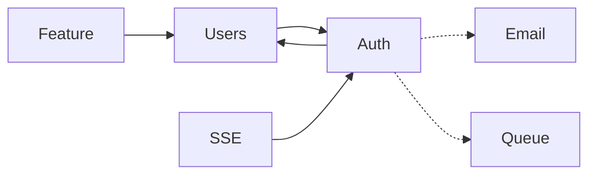

# Module Dependency Graph

> Derived from module specs' Depends On sections. Regenerate when adding modules.
> Last verified: 2026-06-07

**Legend:** solid (`-->`) = FK or hard module dependency · dashed (`-.->`) = optional runtime integration (`IsConfigured()`)

## Dependency Table

| Module | Depends on | Notes |
|--------|------------|-------|
| **Auth** | Users, Email, Queue | Registration inserts `users` row; emails via Mailgun or stdout; queue when `REDIS_URL` set |
| **Users** | Auth | Profile endpoints require JWT identity from Auth middleware |
| **Feature** | Users | Admin CRUD requires `user_type = admin` |
| **SSE** | Auth | Ticket exchange requires valid JWT; hub keyed by user ID |
| **Email** | — | Opt-in via `MAILGUN_API_KEY`; called by Auth handlers |
| **Queue** | — | Opt-in via `REDIS_URL`; Auth email dispatch |

## Change Impact

| If you change… | Re-verify… |
|----------------|------------|
| `users` schema | Auth spec, Users spec, `schema.md`, migrations down order |
| Auth token flow | `flows.md`, Auth spec, frontend `lib/auth.ts`, SSE ticket flow |
| Feature flag keys | Feature spec, `GET /features` public map, admin routes |
| Wire route groups | Module API Surface tables, `permissions.md`, OpenAPI |

See also [Cross-Module Flows](flows.md) and [Permission Matrix](permissions.md).
