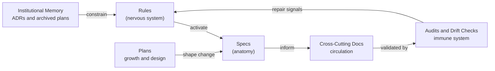

# The Organism Pattern

> This document articulates the pattern behind Golid's documentation system.
> Written as a transferable concept, not an implementation guide.

## The Problem

Documentation for AI-assisted development fails for a specific reason that has nothing to do with quality or quantity.

Human developers browse documentation, hold context across sessions, and ask colleagues when something feels off. AI agents do none of this. They have perfect instruction-following and zero initiative. An AI will follow a consumption path reliably if one exists — but it will never spontaneously think "I should check the spec before modifying this service." It will never notice that two modules share a dependency unless something explicitly tells it to look.

This means the standard approaches — a pile of READMEs (flat) or a structured wiki (hierarchical) — don't work. Both assume the reader will navigate to the right knowledge at the right moment. A human might. An AI won't. The documentation must activate itself.

## Living Layers and the Wiring Between Them

The organism pattern is not a fixed taxonomy. It is a set of living layers, each with a job the others cannot perform. Rules, module specs, plans, cross-cutting docs, audits, drift checks, and institutional memory all participate in the same body. Each layer exists because something specific breaks without it.

**Nervous system — rules.** Reflexive responses to stimuli. When a developer edits a service file or starts a workflow, a rule fires with the patterns for that moment. Rules are thesis-driven: a single sentence stating what the rule enforces and why. Without rules, the AI writes code that works but violates the codebase's conventions — the kind of bug that passes tests and breaks assumptions.

**Anatomy — module specs.** The structure and constraints of each organ in the system. State machines, business rules, validation logic, API surfaces, dependency declarations — all verified against source code with Verified citations (see module spec template), not invented or aspirational. Golid v0.3.0 ships three module specs: **auth**, **users**, and **feature**. Infra subpackages (sse, email, pagination, retry, wire) have no spec — they are documented in architecture and cursor rules instead.

**Growth layer — plans.** Intended change before it becomes current truth. Plans describe goals, non-goals, phasing, acceptance criteria, rollout posture, and QA gates while a feature is still being built. They are not module specs in draft form. When archived, plans become evidence of how the system changed and why the slices were shaped that way.

**Circulation — cross-cutting docs.** Architecture, best practices, CLI reference, testing checklist, and staleness tracker — views that no single module spec can provide. A module spec tells you what one module does. Cross-cutting docs tell you how modules interact with infra (JWT middleware, SSE hub, email dispatch) and how to run the system locally.

**Immune system — audits and drift checks.** The self-diagnosis layer. `scripts/check_spec_drift.sh` flags handler/service changes without a matching spec update. `scripts/check_citation_freshness.sh` validates **`[Verified: path:line]`** citations (line numbers and file existence); module specs use **`[Verified: path, Function()]`** symbol citations enforced by human review and spec-drift, not the line gate. Without this layer, the organism can still grow, but it cannot tell when growth has become decay.

**Institutional memory — ADRs.** Why the organism evolved this way. Golid records decisions in `docs/decisions/` — package extraction strategy, deferred capabilities, selector/verifier tokens, SSE over WebSockets, onMount+signals data fetching.

**The wiring — consumption paths.** Instructions embedded in rules: "Before modifying a module's service, read its spec for business rules." The `document-module` rule enforces same-commit spec sync. The `git-commits` rule reminds contributors to run `check_spec_drift.sh` before commits touching module-owned files. Consumption paths are the connective tissue that makes documentation live rather than archival.

## Golid Module Map

| Handler / service stem | Spec folder |
|------------------------|-------------|
| `auth`, `auth_password`, `auth_verify` | `docs/modules/auth/` |
| `user` | `docs/modules/users/` |
| `feature` | `docs/modules/feature/` |

Stems without specs (ignored by spec-drift): `sse`, `email`, `pagination`, `retry`, `context`, `wire`, and other infra helpers.

## The Core Insight: Composability and Self-Diagnosis

The pattern's value is not in any particular inventory of documents. It's in how the layers activate and validate each other.

A rule activates a spec. A plan shapes the next slice of change. The slice updates the current-state spec as it lands. The spec declares dependencies. Cross-cutting docs capture how modules interact with shared infra. Audits and drift detection check the chain. If any link breaks — a spec drifts from source, a handler changes without a spec update, or a line-number citation points at a deleted file — the system surfaces it.

This is self-diagnosis, not self-healing. The system detects its own decay. It raises a fever. The repair still requires human intervention. But the difference between "documentation that rots silently" and "documentation that tells you when it's wrong" is the difference between a system you can trust and one you can't.

## Why "Organism"

The metaphor is load-bearing, not decorative.

Systems can have dead components. A microservice can sit unused for months and nothing notices. Organisms can't — an organ that stops functioning doesn't just sit there, it becomes a liability. Drift checks enforce this property: documentation that exists but no longer matches its trigger condition is flagged, not ignored.

The consumption paths are synapses in the literal sense — without them, the brain can't reach the limb. Knowledge exists in the spec but can't be acted on by the AI because nothing told it to look. The wiring is what makes documentation into infrastructure.

## What This Is Not

This is not a documentation standard. There is no "you must have exactly these organs."

This is not a template to copy. The specific layers depend on your codebase's architecture, your AI tooling's context model, and which failure modes matter most to you.

This is not static. The system will continue evolving as Golid grows beyond the three starter modules.

The pattern is: **layers that compose, validate each other, and self-detect decay.** The specific layers are an implementation of that pattern. The pattern is what transfers.
