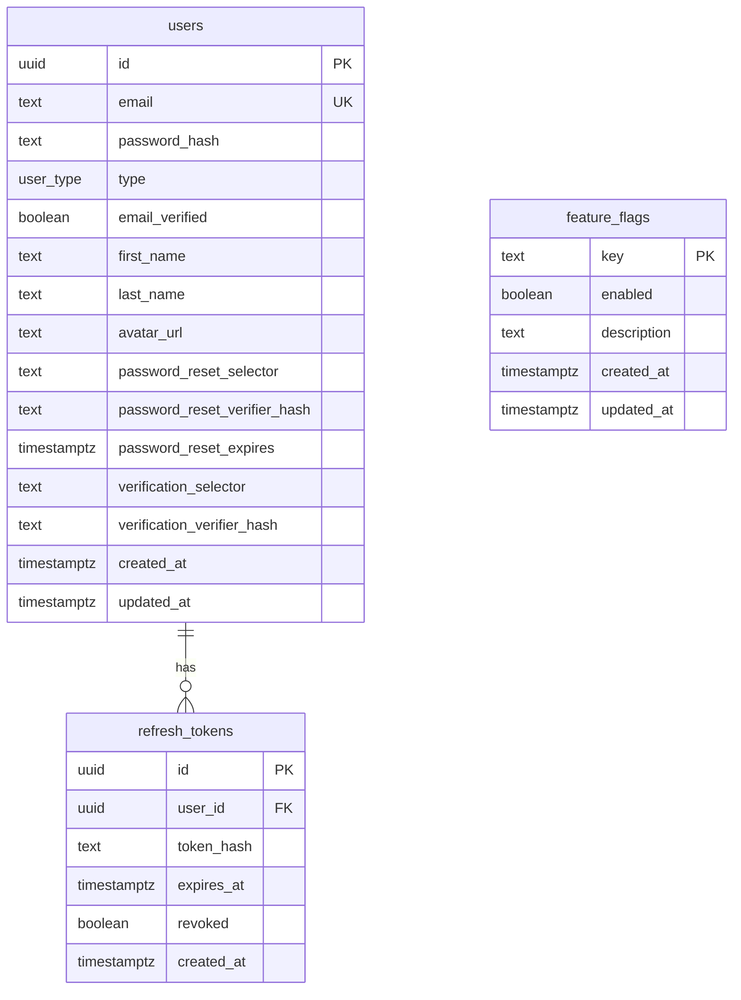

# Schema ERD

> PostgreSQL 16 schema as of migration `000005`. Update when adding migrations.
>
> Last updated: 2026-06-07

## Entity diagram

## Tables

| Table | Purpose | Module |
|-------|---------|--------|
| `users` | Accounts, profile fields, auth token columns | Auth, Users |
| `refresh_tokens` | JWT refresh rotation with revoke | Auth |
| `feature_flags` | Runtime boolean toggles | Feature |

## Enums

| Enum | Values |
|------|--------|
| `user_type` | `user`, `admin` |

## Conventions

- UUID primary keys (`uuid_generate_v4()` / `gen_random_uuid()`)
- `TIMESTAMPTZ` for all timestamps
- `updated_at` trigger on mutable tables
- Selector/verifier pattern on password reset and email verification columns (see ADR-003)

## Migrations

| # | File | Adds |
|---|------|------|
| 1 | `000001_init` | `users`, `user_type` enum, `updated_at` trigger |
| 2 | `000002_auth_tokens` | Password reset + verification columns on `users` |
| 3 | `000003_refresh_tokens` | `refresh_tokens` table |
| 4 | `000004_feature_flags` | `feature_flags` table |
| 5 | `000005_verification_token_hash` | Selector/verifier hash columns |

Source of truth: `backend/migrations/`. Regenerate sqlc after schema changes.
